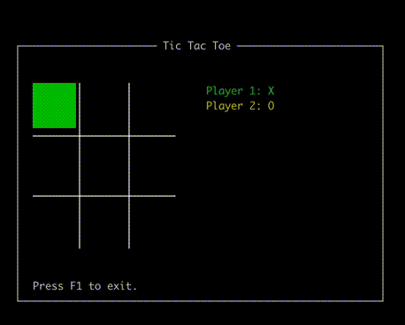

TextUserInterfaces.jl
=====================

[][docs-dev-url]

**WARNING**: This package should be considered alpha!

This package wraps the C library **ncurses** and provide a Julia-like API to
build text user interfaces. The development was highly based on the package
[TermWin.jl](https://github.com/tonyhffong/TermWin.jl).

If you want to use this package as a NCurses wrap, then it should work well.
Notice that if you want a function that is not available, please submit an issue
or (better) a pull request. For the vast majority of cases, this should be a
very easy modification.

If you want to use this package expecting a good Julia API to create text-based
windows and widgets, then you should wait a little. The API is not ready yet.
However, help is very welcome! We have a proof of concept in `examples` folder
of a Tic Tac Toe game creating using the current API:

[docs-dev-url]: https://ronisbr.github.io/TextUserInterfaces.jl/dev
